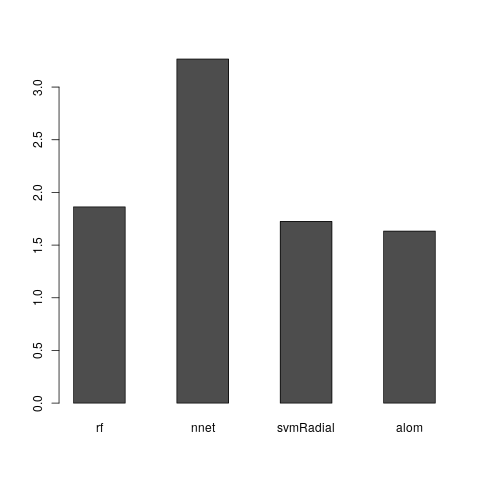

# Exercício 2 - Resultados e justificativa

Para efeito de comparação, foram treinados modelos dos seguintes métodos:
 * Random Forest (rf)
 * Support Vector Machine Radial (svmRadial)
 * Neural Network (nnet)
Estes sendo comparados ao equação alométrica de Spurr e aos resultados dos dados de amostragem.

## Composição do algoritmo
O algoritmo é composto pelas seguintes partes:

1. Carregamento e construção dos dados
1. Treinamento, criação de predições de teste e, também, o calculo de correlação entre os dados de amostra e as predições
1. Escolha e treinamento do melhor modelo de aprendizagem de máquina
1. Criação dos gráficos, para efeito de comparação
1. Saídas padrão para exibição dos dados

## Funcionamento

O algoritmo faz o treinamento dos modelos dos métodos propostos, então, para cada um deles, realiza um teste de predição para valores já existesntes. E, então calcula a correlação entre o resultado das predições e o resultado da massa de dados de treinamento.

Após ter os modelos treinados, faz uma comparação para verificar qual modelo possui uma melhor correlação. Então, este é selecionado e então o mesmo é treinado com toda a massa de dados para ser mantido para utilizações posteriores, para o mesmo caso de uso.

Logo em seguida guarda os gráficos gerados, para comparação entre os métodos. E, então, salva os outputs para análise em um arquivo.

## Arquivos gerados:
 * `modelos.png`: comparação entre o resultado das predições realizadas pelos modelos, e a amostra de dados
 * `correlacoes.png`: gráfico de barras exibindo a relação entre as correlações das predições calculadas
 * `metodo_com_melhor_correlacao.png`: comparação entre as predições do método selecionado e a amostra de dados
 * `output.txt`: saída dos dados para análise da veracidade

## Resultados obtidos
À partir da massa de dados com 100 elementos de amostragem de relações entre as medições e volumes das árvores, tomando-se 80% para treinamento e 20% para teste de predição, o algoritmo, após treinar  os modelos dos métodos propostos, disponibilizou resultados que possibilitou visualizar o melhor método para o problema proposto.

Tomando os resultados obtidos pelas predições de cada um dos modelos treinados, obtemos o gráfico da _Figura 1_.


`Figura 1 - Dados de teste e predições realizadas pelos métodos, para cada amostra; Cores: preto = amostra, vermelho = rf, verde = alom, azul = svm, purpura = nnet`


A partir do cálculo da correlação dos resultados preditos pelos modelos, é possível avaliar qual modelo possui uma acurácia melhor para o cálculo do volume das árvores. Esta comparação é demonstrada no gráfico da _Figura 2_. Sendo que as dimensões foram ajustadas e deslocadas, para melhor visualização da diferença entre os métodos, seguindo o método à seguir.
```
v = maxCor - minCor
p = minCor - v
K = (C) - p
r = K * 100

Onde:
maxCor: valor máximo das correlações
minCor: valor mínimo das c
orrelações
v: variação entre as correlações 
p: piso, valor mínimo para plotagem no gráfico
C: matriz das correlações
K: matriz com recorte dos valores de correlações
r: ampliação dos valores para melhor exibição
```



`Figura 2 - Dados de teste e predições realizadas pelos métodos, para cada amostra`


Neste caso, conclui-se que, a melhor correlação foi obtida pelo modelo treinado a partir do método de Rede Neural (Neural Network). Com o treinamento de um modelo utilizando este método que melhor apresentou resultados para predições, obteve os dados que podem ser visualizados e comparados em relação aos dados da amostragem, na _Figura 3_.


`Figura 3 - Comparação entre as predições realizadas pelo modelo nnet e os dados de amostragem; Cores: preto = amostra, vermelho = nnet`

Foi observado que a escolha do modelo mais eficiente, assim como os resultados, podem variar conforme o `set.seed` utilizado. Outro fator observado foi que o resultado pode ser diferente entre máquinas, mesmo utilizando o mesmo valor para a função `set.seed`
